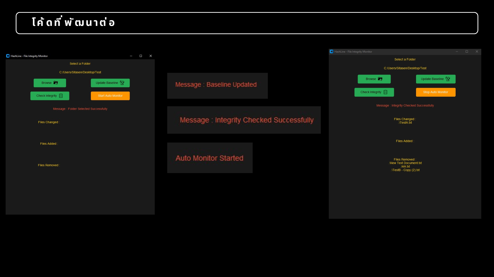

| .jpg) | Hi there, I'm Sirawimon Sitasen! 👋 **B.Sc. Computer Science Student** *Embedded Systems & IoT Developer* |
| --- | --- |

> 3rd-year CS student 💻 \| Embedded Systems & Full-Stack Dev 🔧 \| "Building Things that change the world" 🌍

### 👨‍💻 About Me

I am a 3rd-year Computer Science student at Huachiew Chalermprakiet University with a strong passion for bridging the gap between hardware and software. I enjoy building practical solutions, from IoT-enabled devices to structured desktop and web applications.

I focus on writing clean code and solving problems systematically, whether it's monitoring system integrity or tracking health metrics. I’m always eager to learn and adapt to new technologies in the ever-evolving tech landscape.

- 🔭 Currently working on **Smart CPR Mannequin** (IoT training device) and **Student Activity Management System** (web platform)
- 🌱 Learning Embedded Systems (esp32/Arduino), cloud IoT platforms and Full-stack web development.
- 👯 Looking to collaborate on Embedded Systems, IoT projects, and Open-source software.
- 🏆 Goal : My goal is to leverage IoT and software engineering to develop impactful systems for a better future.
- ⚡ Fun fact: Committed to building innovative solutions that address real-world challenges and improve lives.

### 🎯 Internship 2026

Seeking internship opportunities starting **August 2026**:
- Embedded Systems Engineer
- Software Engineer
- IoT Developer
- Full-stack Developer
- R&D

**Target companies:** Delta Electronics

Interested in industrial automation, IoT systems, and embedded software development.

---

## 🛠️ Languages & Tools

### Programming Languages

### Databases

### Frameworks & Libraries

### Tools & Platforms

### Embedded Systems & IoT

### Design & 3D Modeling

<!-- 
📌 HOW TO ADD MORE BADGES:
All badges above use shields.io format.
If you want to add more, copy the format and find logo names at:
https://github.com/Ileriayo/markdown-badges
-->

---

## 🚀 Highlighted Projects

### 🔧 Smart CPR Training Manikin (working...)
*IoT-enabled CPR training device with real-time feedback*

- **Real-time Monitoring:** Developed a precision sensing system to monitor chest compression depth and rate in real-time.
- **IoT Connectivity:** Integrated ESP32 to transmit training data to a web-based dashboard for performance logging and analysis.
- **Multi-Sensory Feedback:** Utilized LEDs and buzzers to provide immediate corrective guidance to the trainee.
- **Tech Stack:** C/C++, Arduino IDE, ESP32, HTML/CSS, and JavaScript.

<!-- 📌 TODO: ADD LINKS
- [View Repository](link-to-your-repo)
- [Watch Demo](youtube-link-if-available)
-->

### 📱 [HashLine - File Integrity Monitor (FIM)](https://github.com/Pear1790/File-Integrity-Monitor-master-FIM-.git)
*Advanced cybersecurity tool for real-time file system auditing*

- **Integrity Auditing:** Detects unauthorized file modifications (Changed, Added, or Removed) by comparing SHA-512 cryptographic hashes against a secure baseline.
- **Real-time Surveillance:** Enhanced with Multithreading and the Watchdog library to provide instantaneous alerts upon file system interference.
- **Modern Interface:** Refactored the original UI using CustomTkinter for a professional and intuitive user experience.
- **Tech Stack:** Python, hashlib, watchdog, and threading.

<!-- 📌 TODO: ADD LINKS
- [View Repository](link-to-your-repo)
- [Live Demo](live-website-link)
-->

### 🏃 [LIFE CAL System](https://github.com/Pear1790/Life-Cal.git)
*Comprehensive health tracking and nutritional management desktop platform*

- **Health Analytics:** Automates the calculation of critical health metrics, including BMI, BMR, and TDEE, with interactive weight-trend visualization.
- **System Architecture:** Built using MVC Architecture and Design Patterns (Singleton, Repository) to ensure scalable and maintainable code.
- **Secure Data Management:** Features an encrypted user authentication system and a structured SQLite database for food and exercise logging.
- **Tech Stack:** Java , SQLite , HTML , CSS.

<!-- 
📌 ADD MORE PROJECTS HERE (following same format):

### 🎨 Project Name
*Short description*

- ◦ Feature/detail 1
- ◦ Feature/detail 2
- ◦ Tech stack used

- [View Repository](link)
- [Demo](link)
-->

---

## 📄 Resume

Want to know more about my background and experience?

- 📂 [Resume_TH](./assets/ResumeTH.pdf) | [Resume_EN](./assets/ResumeEN.pdf)
- 🌐 [Portfolio Website](https://pear1790.github.io/My-portfolio/)

<!-- 
📌 UPDATE THESE LINKS:
- Replace "your-resume-google-drive-link-here" with actual Google Drive shareable link
- Replace "your-pdf-link-here" with your PDF hosting link
-->

---

## 🏆 Certificates & Activities

Explore my verified achievements, training, and extra-curricular activities:

- 📜 [View Gallery (Certificates)](https://drive.google.com/drive/folders/1__ytC6mmHuG8uh0afaMWIW5pMaeVG1rX?usp=drive_link)
- 📜 [View Gallery (Activity)](https://drive.google.com/drive/folders/1WrQXadTtcFe11SWr21mQTXD75wLuIZaL?usp=drive_link))

<!-- 
📌 UPDATE THESE LINKS:
- Add your Google Drive gallery/folder link (optional but good to have as backup)
- Can be a shared folder with images, certificates, achievement details
-->

---

## 📫 Let's Connect!

💼 [Email](mailto:siriwimonsitasen1@gmail.com) · [LinkedIn](https://www.linkedin.com/in/%E0%B8%AA%E0%B8%B4%E0%B8%A3%E0%B8%B4%E0%B8%A7%E0%B8%B4%E0%B8%A1%E0%B8%A5-%E0%B8%AA%E0%B8%B4%E0%B8%95%E0%B8%B0%E0%B9%80%E0%B8%AA%E0%B8%99-b2713b39b) · [Line](https://line.me/ti/p/Cqf5iyvdk4)

💼 [Phone(1): (+66) 89-030-4422](0890304422) · [Phone(2): (+66) 88-663-4466](0886634466)

---

## 🌱 Strengths & Working Style

**Strengths**
- Fast learner with systematic problem-solving approach
- Excellent team player and communicator
- Detail-oriented with end-user focus

**Working Style**
- Curious and enthusiastic about emerging technologies
- Organized with clear documentation practices
- Patient and calm under pressure

